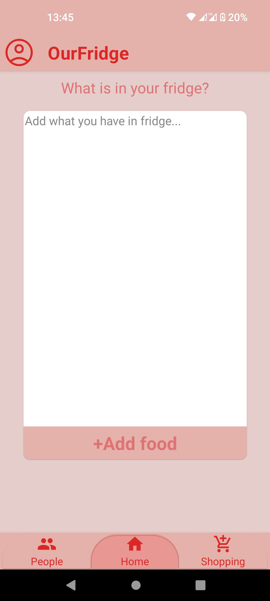
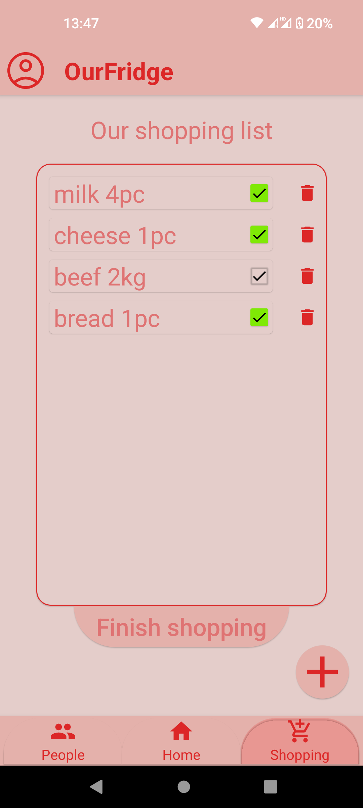

# OurFridge

Have you ever gone shopping and wished to know what you have in your fridge?
Do you want to have your shopping list created by your fridge co-users in one place?

Yep, I can relate to both of these, so I created an app where you can have one fridge shared with whomever you want, and also a shared shopping list.

## Technologies

- Android
- Kotlin
- Jetpack Compose
- Firebase Firestore
- Firebase Authentication

## Features 

- Inviting other users to share a digital fridge and shopping list with them
- Adding, changing, deleting articles in the fridge by every user
- Shopping list that every user of the fridge can modify
- Fridge history, you always know when something was added, deleted, modified, and by whom
- Child protection: If you want to invite your children to the shared fridge, as an admin, you can give them children's status, and they won't be allowed to add articles to the shopping list and the fridge
- Nice minimalistic look

## Screenshots

   
   
    
